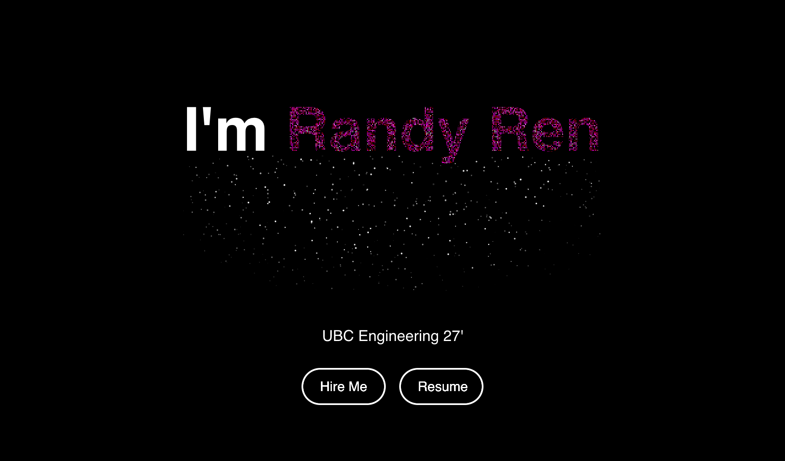
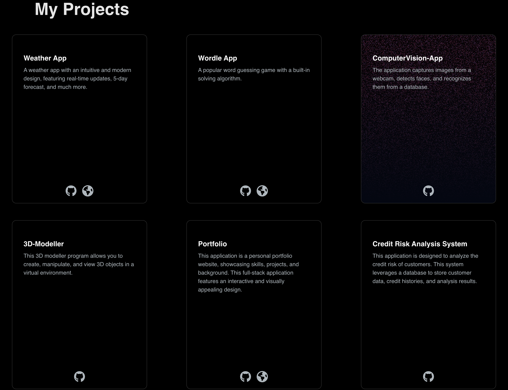
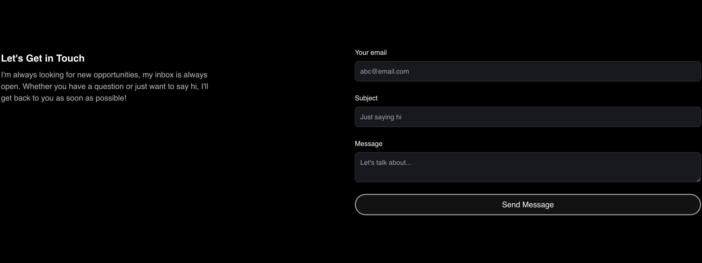

# 🚧 UNDER CONSTRUCTION: CHANGES COMING SOON 🚧

# Randy's Portfolio

## Introduction

Welcome to my portfolio! This is a personal portfolio website created to showcase my skills, projects, and background. Built with an interactive and visually appealing design, this full-stack application highlights various coding projects I've worked on, demonstrating my proficiency in different programming languages and frameworks.

## Features

- **Interactive Design:** Engaging user interface with animations and dynamic content.
- **Responsive Layout:** Fully responsive design to ensure compatibility across different devices.
- **Projects Showcase:** Detailed descriptions and links to my GitHub repositories and live previews.
- **Contact Information:** Easy access to my email and resume for potential collaborations and job opportunities.

## Technologies Used

- **Frontend:** React, Next.js, Tailwind CSS
- **Backend:** Node.js
- **Animation:** Framer Motion, Canvas Reveal Effect
- **Icons:** FontAwesome
- **Deployment:** Vercel

## Gallery

 

 

 



### Weather App
A weather app with an intuitive and modern design, featuring real-time updates, a 5-day forecast, and much more.
- **GitHub:** [Weather App Repository](https://github.com/randyren278/weather-app.git)
- **Live Preview:** [Weather App Live](https://randy-weather-app.vercel.app/)

### Wordle App
A popular word guessing game with a built-in solving algorithm.
- **GitHub:** [Wordle App Repository](https://github.com/randyren278/Wordle.git)
- **Live Preview:** [Wordle App Live](https://randy-eldrow.vercel.app/)

### ComputerVision-App
Captures images from a webcam, detects faces, and recognizes them from a database.
- **GitHub:** [ComputerVision-App Repository](https://github.com/randyren278/computervision.git)

### 3D-Modeller
Allows you to create, manipulate, and view 3D objects in a virtual environment.
- **GitHub:** [3D-Modeller Repository](https://github.com/randyren278/3D-Modeller.git)

### Portfolio
Showcases my skills, projects, and background.
- **GitHub:** [Portfolio Repository](https://github.com/randyren278/randy-portfolio.git)
- **Live Preview:** [Portfolio Live](https://randyren.vercel.app/)

### Credit Risk Analysis System
Analyzes the credit risk of customers using a database to store customer data, credit histories, and analysis results.
- **GitHub:** [Credit Risk Analysis System Repository](https://github.com/randyren278/CreditRiskAnalysis.git)

## Contact

If you have any questions or would like to collaborate, feel free to reach out:
- **Email:** [randyren278@gmail.com](mailto:randyren278@gmail.com)
- **Resume:** [Download Resume](path/to/resume.pdf)

This is a [Next.js](https://nextjs.org/) project bootstrapped with [`create-next-app`](https://github.com/vercel/next.js/tree/canary/packages/create-next-app).

## Getting Started

First, run the development server:

```bash
npm run dev
# or
yarn dev
# or
pnpm dev
# or
bun dev
```

Open [http://localhost:3000](http://localhost:3000) with your browser to see the result.

